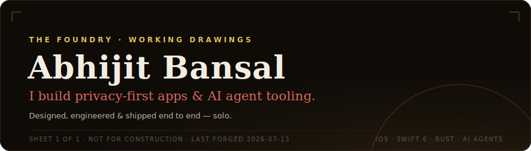
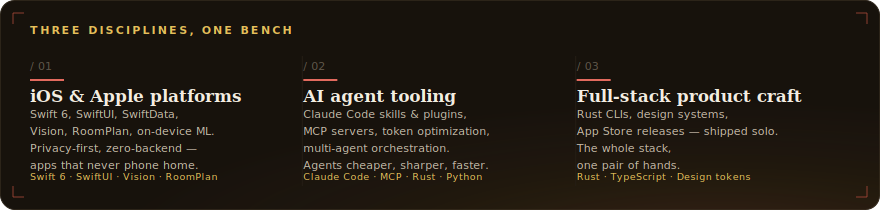
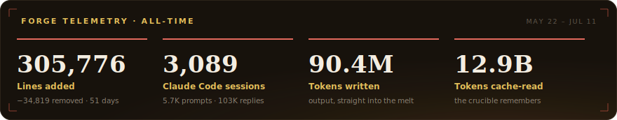
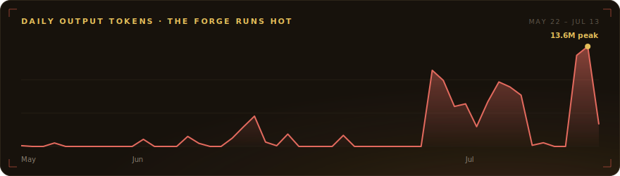
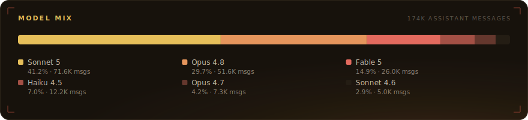
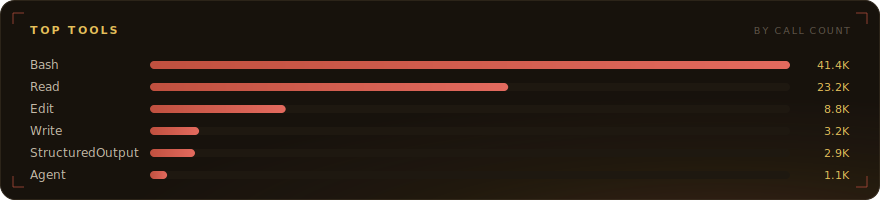
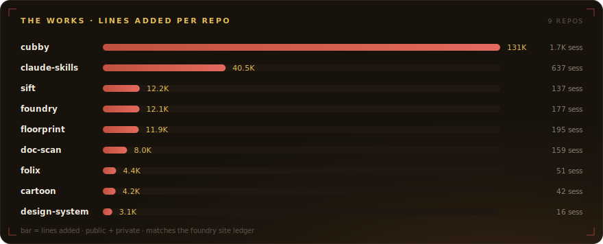
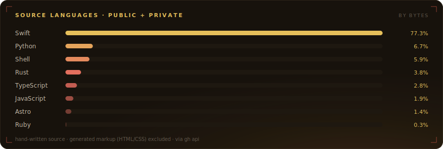

<!--
  github.com/abhijitbansal — profile README.
  Panels in assets/*.svg are generated: `node scripts/build.mjs` from data/telemetry.json.
  Static by design (GitHub freezes SVG animation in README ); self-contained dark
  cards so they read the same on light- and dark-theme profiles.
-->

 

## The work

Products first — public apps and open-source tools. Private repos show curated info, not code.

**Apps · iOS / macOS**

| Project | What it is | Stack |
| :-- | :-- | :-- |
| **[Cubby](https://gotcubby.com)** | Inventory for garage & basement storage. NFC + QR on bins, on-device Vision names items, 3D rack view. Zero backend, zero third-party deps. | `Swift 6` · `SwiftUI` · `SwiftData` · `Vision` |
| **[Paperix](https://abhijitbansal.github.io/paperix-site/)** | Document scanner that makes searchable PDFs with on-device OCR. No cloud, no accounts, no subscription. | `Swift` · `SwiftUI` · `Vision OCR` |
| **[Floorprint](https://abhijitbansal.github.io/floorprint-site/)** | Scan rooms with LiDAR & RoomPlan into editable 2D floor plans. Export PDF / DXF / USDZ / GLB / STEP. | `iOS + macOS` · `RoomPlan` · `SceneKit` |
| **Folix** · _private_ | Privacy-first wealth dashboard — local Plaid pulls, on-device storage, AI-augmented insights. | `macOS` · `Swift` · `GRDB` · `Plaid` |

**AI & agent tooling · open source**

| Project | What it is | Stack |
| :-- | :-- | :-- |
| **[cartoon](https://github.com/abhijitbansal/cartoon)** · [site ↗](https://abhijitbansal.github.io/cartoon/) | Token-optimized CLI output for AI agents — read 12 lines instead of 800, raw logs archived. ~70% fewer tokens. | `Rust` |
| **[claude-skills](https://github.com/abhijitbansal/claude-skills)** · [site ↗](https://abhijitbansal.github.io/claude-skills/) | Skills, plugins & agent tooling for Claude Code: iOS build loops, PM automation, prompt refinement. | `Python` · `Shell` |
| **[sift](https://github.com/abhijitbansal/sift)** · [digest ↗](https://abhijitbansal.github.io/sift/) | Weekly AI-news pipeline: RSS in, one Claude call, HTML digest + Pages archive out. | `Python` · `Claude API` |
| **memekit** · _private_ | Deterministic ASCII meme reactions for CLIs, bots & agents. 45 formats, zero deps — library, CLI & MCP server. | `TypeScript` · `MCP` |
| **design-system** · _private_ | Cross-product design tokens → CSS custom properties, SwiftUI tokens & Tailwind presets for the whole fleet. | `JSON tokens` · `CSS` · `Swift` |

## The forge runs hot

Everything above is built with Claude Code — and the workshop keeps its own books. Parsed locally from **3,141 session logs**, on-device like everything else. Snapshot as of Jul 12, 2026.

<table>
<tr>
<td width="50%"></td>
<td width="50%"></td>
</tr>
</table>

Counted from 3,141 local Claude Code session logs by a <a href="https://github.com/abhijitbansal/claude-skills">claude-skills</a> script — on-device, like everything else here. Panels regenerated with <code>node scripts/build.mjs</code>. &nbsp;·&nbsp; <a href="https://github.com/abhijitbansal/abhijitbansal/blob/main/docs/building-a-telemetry-profile-readme.md">how this was built ↗</a> &nbsp;·&nbsp; <a href="https://abhijitbansal.com">abhijitbansal.com</a>

